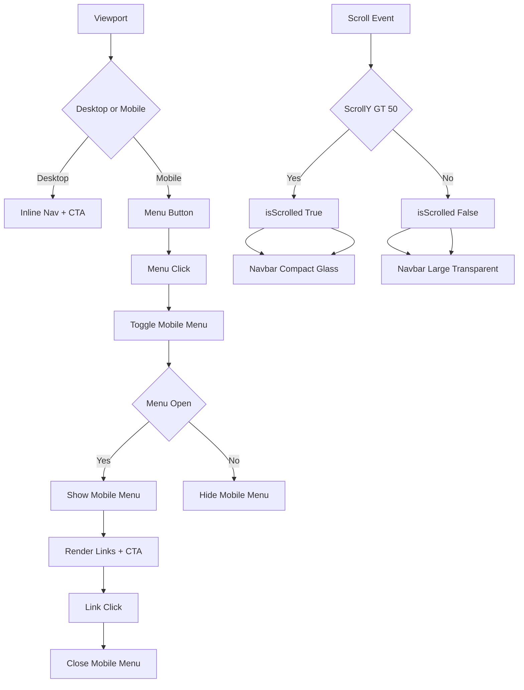

# 🧠 Navbar Code + State Flow Walkthrough

This is how I mentally model and implement my navbar. It is driven by **two independent UI states** and reacts to **scroll + click events**.

---

# 🧩 Core State Model (What controls everything)

I only track two pieces of state:

```js
isScrolled
isMobileMenuOpen
```

Everything in the navbar UI is derived from these two values.


# 🧠 Mental Model

## 1. 📜 Scroll-driven UI (`isScrolled`)

I listen to scroll events and update state:

* If the user scrolls past 50px:

  * I set `isScrolled = true`
  * Navbar becomes:

    * compact padding
    * glass/blur effect

* If the user scrolls back up:

  * I set `isScrolled = false`
  * Navbar returns to:

    * transparent background
    * larger spacing

👉 This creates a smooth “shrink on scroll” effect.

---

## 2. 📱 Mobile menu system (`isMobileMenuOpen`)

This system is fully click-driven:

* Clicking the menu button:

  * toggles open or closed state

* If `true`:

  * I render the mobile menu

* If `false`:

  * I remove it from the DOM

---

## 3. 🔄 How UI reacts to state

React automatically re-renders based on state changes:

### When `isScrolled` changes

* Navbar styling updates instantly

### When `isMobileMenuOpen` changes

* Mobile menu appears or disappears

### When a nav link is clicked

* I force close the menu:

```js
setIsMobileMenuOpen(false)
```

This ensures smooth navigation UX.

---

# 🧭 Simplified Flow View

```text
SCROLL EVENT
   ↓
isScrolled -> Navbar style changes

CLICK MENU BUTTON
   ↓
isMobileMenuOpen -> Mobile menu toggles

CLICK NAV LINK
   ↓
isMobileMenuOpen = false (menu closes)
```

---

# 🚀 Big Picture Mental Model

I think of this navbar as **two reactive systems running in parallel**:

## 🌊 1. Scroll System

* Detects user position
* Adjusts navbar appearance dynamically

## 📱 2. Interaction System

* Handles mobile menu state
* Controls navigation visibility

---

# ✨ Final Insight

What makes this navbar feel modern is not complexity — it is **state-driven UI design**:

* Scroll → visual adaptation
* Click → interaction control
* React → automatic synchronization

Everything else is just a clean expression of these two ideas.
